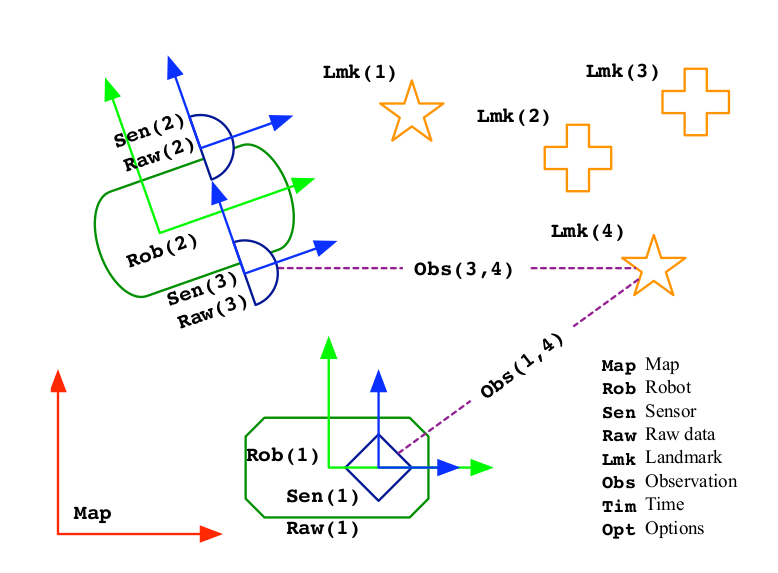

# EKF-SLAM

**注：这里是在SLAM_Course 材料的基础上对ekf-slam及其实现过程进行阐述，建议对比原文来看**

### Simultaneous Localization and Mapping (SLAM)问题介绍

SLAM中文翻译同时建图与定位，是一种广泛存在于生活中的问题：当我们探索一个未知空间的时候，就是一个建图与定位的过程，一边在空间中行走，一边观察空间中的标记物，并在脑海中逐渐构建一副地图，根据这幅地图，我们可以判定如何从这个空间中离开，判定当前所在的未知。SLAM技术目前主要应用于移动机器人技术，包括仓储机器人以及自动驾驶。

SLAM通常包含3种不断重复的操作：

1. 移动：机器人移动到一个新位置，通常可以根据移动指令及运动模型推断得到新的位置，但是由于移动过程包含了不可消除的噪声，所以计算得到的位置并不准确，**这里比较关心车辆的运动模型Motion model**
2. 观测环境中的地标点：当移动到一个新位置后，机器人可以感知得到环境中新的地标点，这些地标点会被加入到地图中。我们需要根据机器人位姿和感知数据，确定地标点在地图上的位置。由于传感器感知也包含了各类噪声，所以同样无法准确计算地标点的位置。**这里比较关心逆向观测模型（Inverse observation model）**
3. 将观测到的地标点和地图上已有的地标点关联起来。在移动过程中，机器人可能会在多个位置观测到同一个地标，如果计算准确以及不存在噪声，那么机器人在不同位置观测相同的地标得到的位置应该是相同的，但是实际过程中，噪声以及计算误差会使得计算的位置有比较大的偏差。这时可以通过将数据关联起来，消除运动过程和观测过程的累计误差。**这里比较关心观测模型（Direct observation model）**

针对这3个操作，这里只探索平面上的机器人移动，对于三维空间上的移动这里暂不考虑。

SLAM中的各种关系：

#### 三类模型介绍

1. Motion-model

   通常机器人的移动是根据发出的指令信号$\mathbb u$和执行的过程方差$ Q $决定：
   $$
   R \leftarrow \mathbb f(R, \mathbb u, Q)
   $$
   通常机器人的状态可以用$R_2 = (x, y, \theta)$表示，三维是用$R_3=(x, y, z, roll, pitch, yaw)$表示。例如在低速情况下，可以用自行车模型作为运动模型。模型具体根据机器人的移动方式来选择。

2. Observation-model

   机器人通过某个传感器S观测到某个地标点$\mathcal L_i$,则有测量值$\mathbb y_i$：
   $$
   \mathbb y_i = h(R, S, \mathcal L_i)
   $$

3. Inverse-observation-model

   通过测量值和车辆的状态，我们可以得到地标$\mathcal L_i$:
   $$
   \mathcal L_i = g(R, S, \mathbb y_i)
   $$
   理想情况下，g是h的逆，但是很多时候h是不可逆的，例如单目视觉里。

### EKF-SLAM

​	*这里假设已经了解EKF—SLAM算法了，如果不清楚，可以参看[EKF](./Nonlinear-kalman.md)*

这里先给出EKF和SLAM以及机器人的动作对应关系表。

| Event                  | SLAM            | EKF            |
| ---------------------- | --------------- | -------------- |
| Move                   | Robot Motion    | ekf prediction |
| 观测到新的Landmark     | Landmark 初始化 | 添加状态       |
| 观测到已有Landmark     | 地图修正        | EKF-correction |
| 地图上已有landmark损毁 | Landmark 删除   | 状态删除       |

接下来，我们分别讨论每一类事件，并讨论如何维护地图。